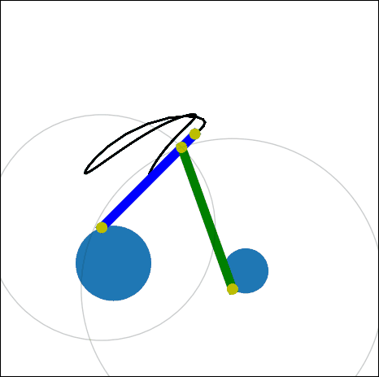
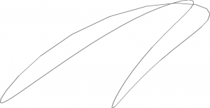
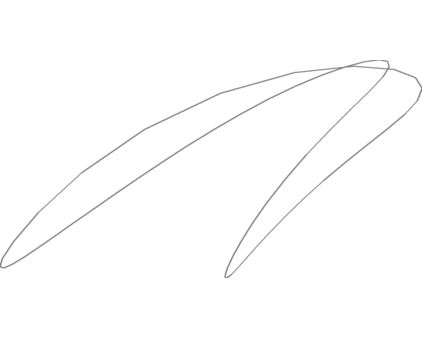
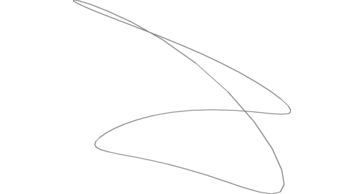

# Stagger

Training set generation for computational design of mechanical linkages. While the intention is for machine learning classifiers, this is hopefully a clearly written and extensible solution for general mechanical linkage solving.

# What is this?

This project is inspired by the Disney Research whitepaper on [computational design of mechanical characters](https://www.disneyresearch.com/publication/computational-design-of-mechanical-characters/), and associated [Youtube video](https://www.youtube.com/watch?v=DfznnKUwywQ). They have no 
source code available, and sparse details on exact methodology. Which is fine, because it's fun to go in another direction.
This project generates the training data required for machine learning models to do inverse kinematics on automata.

# How does it work?

### Definition

Each parameter must be fully defined.
In a two-bar linkage, there are:

 - Two bars
	 - Each has a length
	 - One of which has a joint somewhere along that distance
 - Two drive anchors
	 - Each has X and Y position, speed, and initial starting position

### Generation

By initially displaying the full system, we can see how a two bar linkage works.

We can pull out the just endpath, because that is the only result we care about.

By varying one parameter in the system, we can see how the endpath changes.

And finally, we define several parameters to vary.

### Storage

Training sets don't do any good if they can't be stored.
Currently supported methods are PNG images of each endpath, "pickled" serialisation objects of the system, or more pragmatically, an SQLite database. This database contains the system endpaths, as well as the parameter values that created them.

### Animation

An automata must be modeled and animated in some sort of CAD package. Limbs or other attachment points must be defined, and then the paths exported.

### Matching

The generated path must be compared to the training set, and then the input parameters pulled from the best match.
This data has not yet been used on any ML models, to my knowledge.

## Next Steps

- Build an appropriate ML classification algorithm
- Design an automata
- Export linkage attachment endpoints
- Run the ML system to get linkage parameters for each of the motion systems
- Design frame to hold linkages
- Laser cut and build entire system

## Future Improvements

This framework has been built in a linkage-system-agnostic manner. Currently, only two bar linkages are implemented, but the system could easily be extended to support four bar linkages, or two bar linkages with curved bars, or others.

Eccentric gears for the anchors for to fine-tune torque and speed are also possible improvements.
